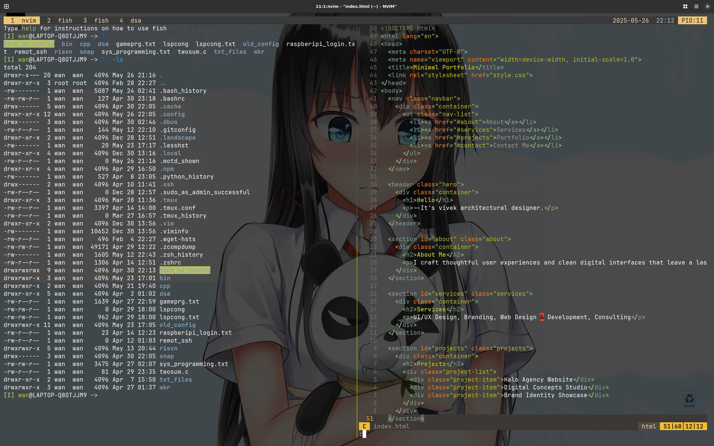

# 🛠️ My Dotfiles/configs

A curated collection of configuration files for a clean, fast, and productive development environment.  
This includes settings for **Neovim**, **Tmux**, **Fish shell**, and various handy **shell scripts**.

---

## 📦 Contents

| Component   | Description                                      |
|-------------|--------------------------------------------------|
| `nvim/`     | Neovim config (Lua-based, plugin-rich setup)     |
| `tmux.conf` | Tmux configuration with productivity shortcuts   |
| `fish/`     | Fish shell config, aliases, and completions      |
| `scripts/`  | Custom shell scripts for common CLI tasks        |

---

## 🚀 Features

- 🧠 IDE-like **Neovim** with LSP, auto-complete, and Treesitter
- 🔄 Seamless **Tmux** keybindings and session management
- 🐟 Friendly and fast **Fish** shell with useful aliases and functions
- 📜 Collection of small utility **shell scripts** for daily use
- 🔧 Designed to be modular and easy to install across devices

---

## 🧰 Installation

Clone the repo:

```bash
git clone https://github.com/risvn/configs.git
cd configs
```

## 🖥️ My Neovim + Tmux Workflow

Here's a quick peek at my terminal-based development environment using Tmux and Neovim:



