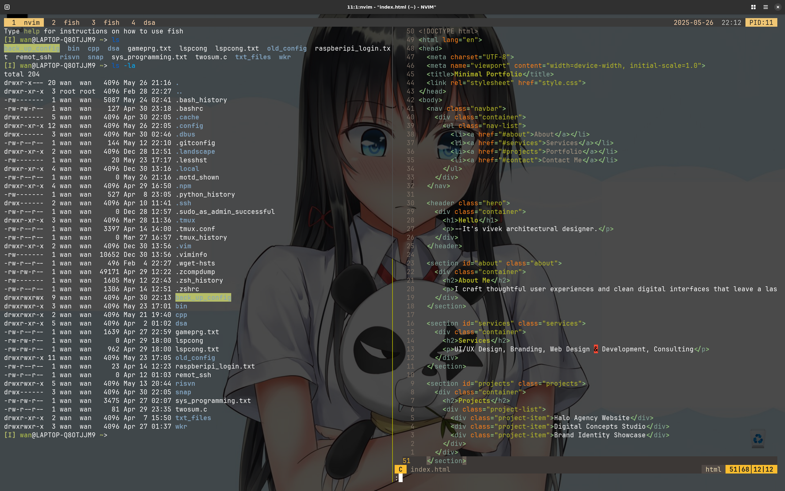
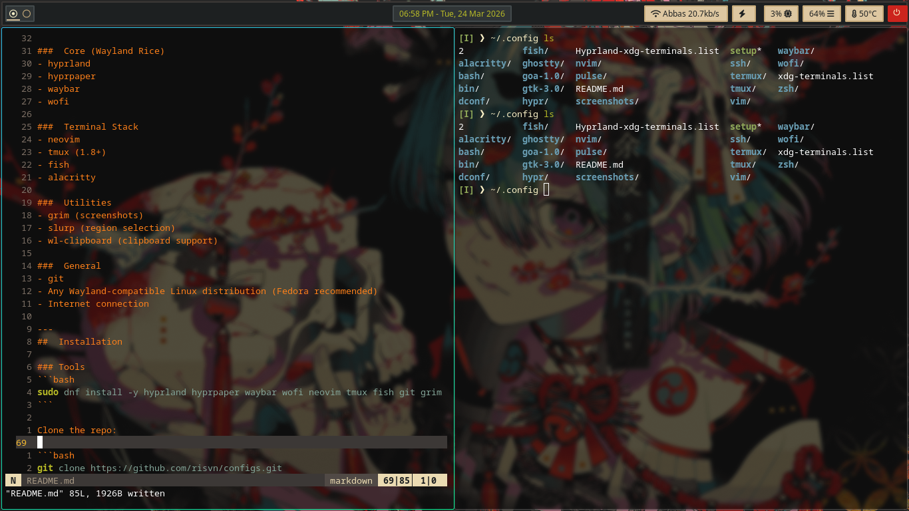

#  Hyprland Rice Setup (Fedora)

A minimal, fast, and keyboard-driven Linux desktop powered by Hyprland and Wayland tools.

---


```bash
.config/
├── hypr/
│   ├── hyprland.conf
│   └── hyprpaper.conf
├── waybar/
├── wofi/
├── fish/
├── nvim/
└── tmux.conf
```

## Just config files for some programs that I actively use.


| Component        | Description                                      |
|------------------|--------------------------------------------------|
| `hypr/`          | Hyprland config (keybinds, animations, layouts)  |
| `hyprpaper.conf` | Wallpaper configuration for hyprpaper            |
| `waybar/`        | Waybar config (modules, styling, scripts)        |
| `wofi/`          | Wofi launcher config and styling                 |
| `nvim/`          | Neovim config (Lua-based, plugin-rich setup)     |
| `tmux.conf`      | Tmux configuration with productivity shortcuts   |
| `fish/`          | Fish shell config, aliases, and completions      |
| `scripts/`       | Custom shell scripts for common CLI tasks        |

---

## ⚙️ Requirements

###  Core (Wayland Rice)
- hyprland
- hyprpaper
- waybar
- wofi

###  Terminal Stack
- neovim
- tmux (1.8+)
- fish
- alacritty

###  Utilities
- grim (screenshots)
- slurp (region selection)
- wl-clipboard (clipboard support)

###  General
- git
- Any Wayland-compatible Linux distribution (Fedora recommended)
- Internet connection

---
##  Installation

### Tools
```bash
sudo dnf install -y hyprland hyprpaper waybar wofi neovim tmux fish git grim slurp wl-clipboard 
```

Clone the repo:

```bash
git clone https://github.com/risvn/configs.git
cd configs
```


Here's a quick peek at my terminal-based development environment using Tmux and Neovim:



Fedora + Hyprland + waybar:


## Installation 
make the setup script executable and run it
```bash
chmod +x setup
./setup
```
